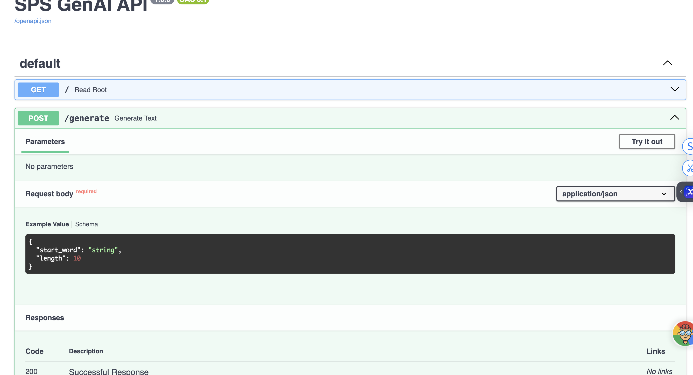

# SPS GenAI API – Assignment 1

**Author:** Aqib Rahim · **Course:** Applied Generative AI

A FastAPI service with two models:

| Model | What it does | Source |
| --- | --- | --- |
| **spaCy word embeddings** | Returns the 300-dimensional embedding vector for a query word | Module 2 → **Assignment 1 (new)** |
| **Bigram text generator** | Generates text from a start word using bigram probabilities | Module 3 class activity |

---

## Quick start with Docker (recommended)

**Requirements:** [Docker Desktop](https://www.docker.com/products/docker-desktop/) installed and **running**. Nothing else is needed; Python, all libraries and the spaCy model are installed inside the image.

```bash
git clone https://github.com/aqibrahim/sps_genai.git
cd sps_genai
docker build -t sps-genai .
docker run -p 8000:80 sps-genai
```

- The first build takes a few minutes (it downloads Python, spaCy and the `en_core_web_md` model, about 40 MB).
- The server is ready when the log shows: `Uvicorn running on http://0.0.0.0:80`
- Open **http://127.0.0.1:8000/docs** in a browser.
- Stop the server with **Ctrl+C**.

The container listens on port 80 internally; `-p 8000:80` maps it to port 8000 on your machine. The image works on both Intel/AMD (x86_64) and Apple Silicon (arm64) machines.

---

## Verified results

The API was built and tested with Docker. See **[docs/TEST_RESULTS.md](docs/TEST_RESULTS.md)** for the Swagger UI screenshot and the actual responses from each endpoint (including the full 300-value embedding for `"king"`).



---

## Testing the API

### Option A: Browser (Swagger UI)

1. Open **http://127.0.0.1:8000/docs**.
2. Click **POST /embedding** → **Try it out**.
3. Replace the request body with `{"word": "king"}` and click **Execute**.
4. Expected: response code **200** with `"dimension": 300` and a list of 300 numbers.

Quickest check: open **http://127.0.0.1:8000/embedding/apple** directly in the browser.

### Option B: Command line (curl)

**Word embedding** (Assignment 1 endpoint):

```bash
curl -X POST http://127.0.0.1:8000/embedding \
  -H "Content-Type: application/json" \
  -d '{"word": "king"}'
```

Expected response (vector shortened here):

```json
{
  "word": "king",
  "in_vocabulary": true,
  "dimension": 300,
  "embedding": [-0.6064, -0.5120, 0.0065, -0.2919, ...]
}
```

**Word similarity:**

```bash
curl -X POST http://127.0.0.1:8000/similarity \
  -H "Content-Type: application/json" \
  -d '{"word1": "king", "word2": "queen"}'
```

Expected: `{"word1": "king", "word2": "queen", "similarity": 0.38...}`

**Bigram text generation:**

```bash
curl -X POST http://127.0.0.1:8000/generate \
  -H "Content-Type: application/json" \
  -d '{"start_word": "the", "length": 8}'
```

Expected (output is random, so it varies each call): `{"generated_text": "the count of monte cristo is a novel"}`

---

## Endpoints

| Method | Path | Request | Response |
| --- | --- | --- | --- |
| GET | `/` | – | `{"Hello": "World"}` (health check) |
| POST | `/embedding` | `{"word": "king"}` | `word`, `in_vocabulary`, `dimension`, `embedding` (list of 300 floats) |
| GET | `/embedding/{word}` | word in the URL | same as `POST /embedding` |
| POST | `/similarity` | `{"word1": "king", "word2": "queen"}` | cosine similarity between the two word vectors |
| POST | `/generate` | `{"start_word": "the", "length": 10}` | `generated_text` (`length` must be 1–100) |

**Input rules and errors**

- `/embedding` accepts **one word**. Multi-word input such as `"two words"` returns **400** with `{"detail": "Please provide a single word."}`.
- Missing or invalid fields return **422** (FastAPI validation error).
- A word not in spaCy's vocabulary still returns **200**, with `"in_vocabulary": false` and an all-zero vector.

---

## How it works

- **Embeddings** (`app/embedding_model.py`): loads spaCy's `en_core_web_md` model once at startup. For a query word it returns the token's static 300-dimensional vector (`token.vector`). Similarity is the cosine similarity of two word vectors (`token.similarity`).
- **Bigram model** (`app/bigram_model.py`): tokenizes a small corpus, counts word pairs, and converts them to conditional probabilities P(next word | current word). Generation samples each next word from those probabilities, stopping early if a word has no known continuation.
- **API** (`app/main.py`): FastAPI routes with Pydantic request models for input validation.

The spaCy model is pinned as a dependency in `pyproject.toml` and locked in `uv.lock`, so `uv sync` (and the Docker build) installs it automatically. No separate `python -m spacy download` step is needed.

---

## Project structure

```
sps_genai/
├── app/
│   ├── __init__.py
│   ├── main.py              # FastAPI app and endpoints
│   ├── embedding_model.py   # spaCy word-embedding model (Assignment 1)
│   └── bigram_model.py      # Bigram text generator (Module 3)
├── Dockerfile               # Container build (Python 3.12 + uv)
├── pyproject.toml           # Dependencies, including the spaCy model
├── uv.lock                  # Exact locked versions
├── .python-version
├── probability_solutions.py # Part 2 calculation checks (not used by the API)
├── docs/
│   ├── TEST_RESULTS.md      # Screenshot and actual API responses
│   ├── embedding_king_response.json
│   └── screenshots/
└── README.md
```

---

## Running without Docker (optional)

Requires [uv](https://docs.astral.sh/uv/getting-started/installation/) and Python 3.12+.

```bash
uv sync
uv run fastapi dev app/main.py
```

Then open http://127.0.0.1:8000/docs.

---

## Troubleshooting

| Problem | Fix |
| --- | --- |
| `failed to connect to the docker API` / `Cannot connect to the Docker daemon` | Docker Desktop isn't running. Open it and wait until the whale icon stops animating, then retry. |
| `docker build requires 1 argument` | Add the `.` at the end: `docker build -t sps-genai .` |
| `port is already allocated` | Port 8000 is in use. Run on another port: `docker run -p 8001:80 sps-genai`, then open http://127.0.0.1:8001/docs |
| Page doesn't load right after `docker run` | Wait for the `Uvicorn running` log line; the spaCy model takes a few seconds to load. |
| `"in_vocabulary": false` | The word isn't in spaCy's vocabulary. Try a common English word such as `king`, `apple` or `computer`. |
