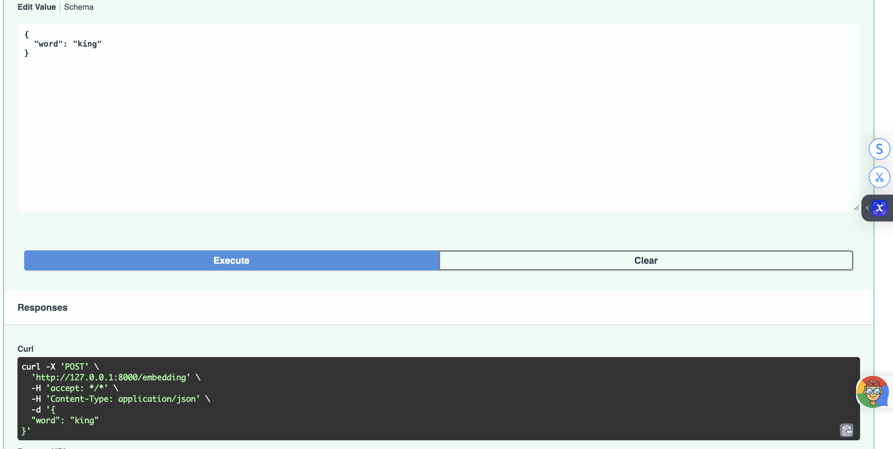
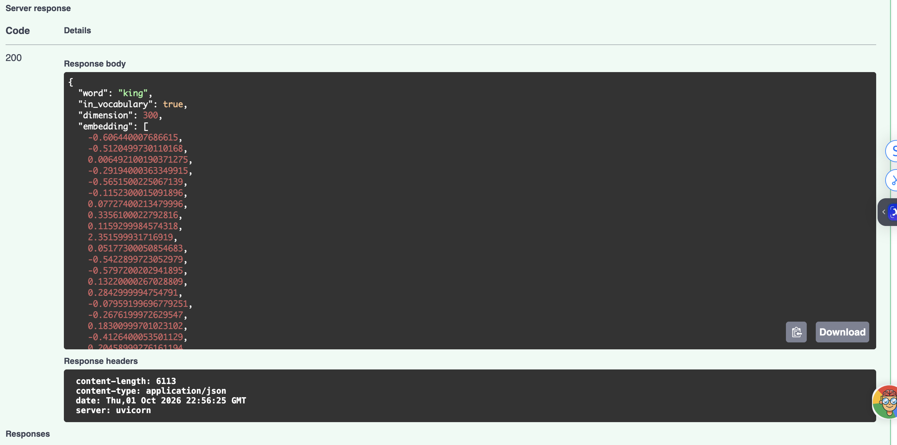
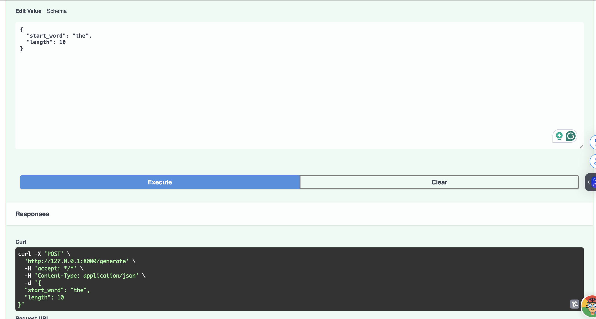
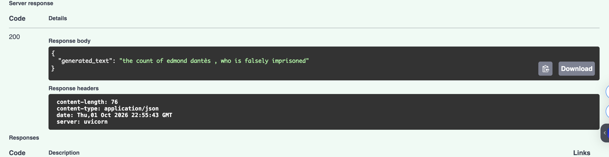

# Test Results

The API was built and run with Docker on **October 1, 2026** (macOS, Apple Silicon) using:

```bash
docker build -t sps-genai .
docker run -p 8000:80 sps-genai
```

All requests below were sent through the Swagger UI at http://127.0.0.1:8000/docs.

## Swagger UI running from the Docker container


---

## 1. `POST /embedding` (Assignment 1)

**Request**

```bash
curl -X POST http://127.0.0.1:8000/embedding \
  -H "Content-Type: application/json" \
  -d '{"word": "king"}'
```

**Response: `200 OK`**

```json
{
  "word": "king",
  "in_vocabulary": true,
  "dimension": 300,
  "embedding": [
    -0.606440007686615,
    -0.5120499730110168,
    0.006492100190371275,
    -0.29194000363349915,
    -0.5651500225067139,
    "... 290 more values ...",
    0.2286199927330017,
    0.21859000623226166,
    -0.19043999910354614,
    -0.10253000259399414
  ]
}
```

Full 300-value response: [`embedding_king_response.json`](embedding_king_response.json)

**Screenshots (Swagger UI, Docker)**

Request:



Response (code 200, 300-dimensional vector):



**Result:** the endpoint returns spaCy's 300-dimensional `en_core_web_md` vector for the query word. ✅

---

## 2. `POST /generate` (bigram model, Module 3)

**Request**

```json
{
  "start_word": "the",
  "length": 10
}
```

**Response: `200 OK`** (two separate runs)

```json
{ "generated_text": "the count of edmond dantès , who is falsely imprisoned" }
```

```json
{ "generated_text": "the story of edmond dantès , who is another example" }
```

**Screenshots (Swagger UI, Docker)**

Request:



Response (code 200):



**Result:** text is generated word by word from bigram probabilities. After "is", the model switched from the Monte Cristo sentence to "this is another example sentence", since "is" is followed by different words in the corpus. Output is random, so it varies between calls, as the two runs above show. ✅

---

## 3. `POST /similarity` (extra)

**Request**

```json
{
  "word1": "king",
  "word2": "queen"
}
```

**Response: `200 OK`**

```json
{
  "word1": "king",
  "word2": "queen",
  "similarity": 0.38253089785575867
}
```

**Result:** cosine similarity between the two word vectors. ✅

---

## 4. Input validation

| Request | Response |
| --- | --- |
| `POST /embedding` with `{"word": "two words"}` | `400` – `{"detail": "Please provide a single word."}` |
| `POST /embedding` with `{}` | `422` – validation error (missing `word`) |

## Summary

| Endpoint | Status |
| --- | --- |
| `GET /` | ✅ 200 |
| `POST /embedding` | ✅ 200, 300-d vector |
| `GET /embedding/{word}` | ✅ 200 |
| `POST /similarity` | ✅ 200 |
| `POST /generate` | ✅ 200 |
